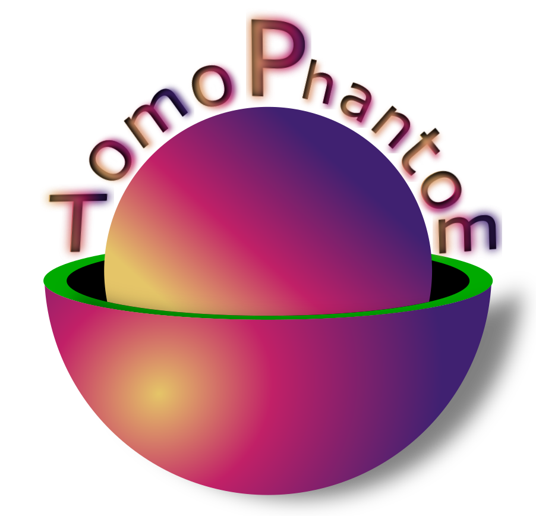
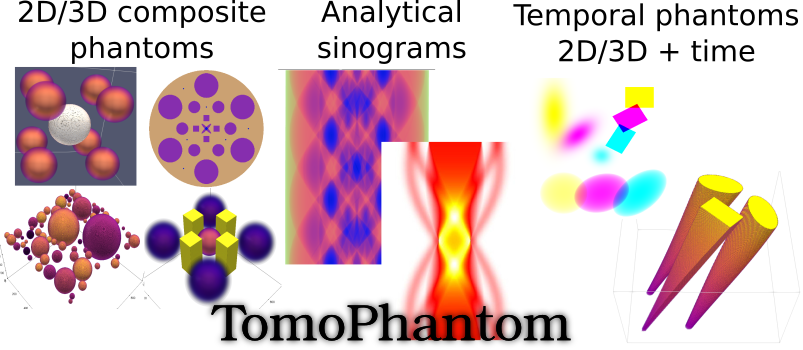

<table>
    <tr>
        <td>
        <div align="left">
          <br>  
        </div>
        </td>
        <td>
        <font size="5"><b> TomoPhantom </b> <a href="https://doi.org/10.1016/j.softx.2018.05.003">[1]</a> is a toolbox written in C language to generate customisable 2D-4D phantoms (with a temporal capability) and their analytical projection data (parallel-beam geometry) for various image processing (e.g. tomographic reconstruction, denoising, deblurring, segmentation, etc.) and machine/<a href="https://github.com/dkazanc/U-Net-tomography">deep learning</a> tasks (e.g. segmentation, classification, clustering, etc.). </font>
        </td>
    </tr>
</table>

| Master | Development | Anaconda binaries | Binder |
|--------|-------------|-------------------|--------|
| [](https://anvil.softeng-support.ac.uk/jenkins/job/CILsingle/job/TomoPhantom/) | [](https://anvil.softeng-support.ac.uk/jenkins/job/CILsingle/job/TomoPhantom-dev/) |   [ ](https://anaconda.org/ccpi/tomophantom) | [](https://mybinder.org/v2/gh/dkazanc/TomoPhantom/HEAD) |

<div align="center">
  <br>
  <br>
</div>

****************
 <div class="post-content">
        <h3 class="post-title">About TomoPhantom </h3>
        <p> TomoPhantom is recommended for various image processing tasks that require extensive numerical testing: image reconstruction, denoising, deblurring, etc. Specifically, TomoPhantom is best-suited for testing various tomographic image reconstruction (TIR) methods. For TIR algorithms testing, the popular <a href="https://en.wikipedia.org/wiki/Shepp%E2%80%93Logan_phantom">Shepp-Logan phantom</a> is not always a good choice due to its piecewise-constant nature. This toolbox provides a simple modular approach to efficiently build customisable 2D-4D phantoms consisting of piecewise-constant, piecewise-smooth, and smooth analytical objects.
        </p>
 </div>

### What **TomoPhantom** can do:         
 * Generate 2D synthetic phantoms made of Gaussians, parabolas, ellipses, cones and rectangulars.
 * Generate 3D synthetic phantom and 4D (temporal) extensions.
 * Calculate analytical Radon transform of 2D-4D models and also their numerical projections.
 * Model Gaussian or Poisson noise and some typical acquisition artifacts (zingers, rings, shifts, partial volume effect and others)
 * Perform reconstructions avoiding <a href="http://www.sciencedirect.com/science/article/pii/S0377042705007296">'Inverse Crime'</a> using <a href="https://github.com/dkazanc/ToMoBAR">ToMoBAR</a>, <a href="http://www.astra-toolbox.com/">ASTRA-toolbox</a> or <a href="http://tomopy.readthedocs.io/en">TomoPy</a> packages.

### Try **TomoPhantom** now:
Run TomoPhantom in Binder [HERE](https://mybinder.org/v2/gh/dkazanc/TomoPhantom/HEAD) with jupyter-notebooks in Demos/Python/jupyter-notebooks

### **TomoPhantom** prerequisites:

 * Python (tested ver. 3.5-3.8); Cython OR
 * [MATLAB](www.mathworks.com/products/matlab/)
 * C compilers: GCC/MinGW/[TDM-GCC](http://tdm-gcc.tdragon.net/)/Visual Studio
 * [CMake](https://cmake.org) (if this installation route is chosen)

### Other dependencies (if the reconstruction is performed):
 * [ToMoBAR](https://github.com/dkazanc/ToMoBAR)
 * [ASTRA-toolbox](http://www.astra-toolbox.com/)
 * [TomoPy](http://tomopy.readthedocs.io)

## Installation:

### Binary installation
Tomophantom is distributed as conda package for linux-64 from the [ccpi](https://www.ccpi.ac.uk) [channel](https://anaconda.org/ccpi). To install

```
conda install tomophantom -c ccpi
```

### Install from sources

The package comes as a [CMake](https://cmake.org) project so you will need CMake (v.>=3) to configure it. Additionally you will need a C compiler, and a build tool as `make` (on linux). The toolkit may be used with Python and/or Matlab for which we provide wrappers. TomoPhantom's core is built as shared library and it should be possible to call it directly from C/C++, but currently no C/C++ API is available.

Prerequisites:
1. [CMake](https://cmake.org) >= 3.0
2. a C compiler with OpenMP
3. [libm](https://en.wikipedia.org/wiki/C_mathematical_functions#libm) on linux
4. [Cython](https://cython.org/) to build the Python wrappers (optional)
5. MATLAB installation to build MATLAB wrappers (optional)

#### Build

1. Clone this repository to a directory, i.e. `TomoPhantom`,
2. create a build directory.
3. Issue `cmake` to configure (or `cmake-gui`, or `cmake`, or `cmake3`). Use additional flags to fine tune the configuration.

#### CMake flags
Flags used during configuration

| CMake flag | type | meaning |
|:---|:----|:----|
| `BUILD_PYTHON_WRAPPER` | bool | `ON\|OFF` whether to build the Python wrapper |
| `BUILD_MATLAB_WRAPPER` | bool | `ON\|OFF` whether to build the Matlab wrapper |
| `CMAKE_INSTALL_PREFIX` | path | your favourite install directory |
| `PYTHON_DEST_DIR` | path | python modules install directory (default `${CMAKE_INSTALL_PREFIX}/python`) |
| `MATLAB_DEST_DIR` | path | Matlab modules install directory (default `${CMAKE_INSTALL_PREFIX}/matlab`)|
| `CONDA_BUILD`| bool | `ON\|OFF` whether it is installed with `setup.py install`|
| `Matlab_ROOT_DIR` | path | Matlab directory|
|`PYTHON_EXECUTABLE` | path | /path/to/python/executable|

Here an example of build on Linux:

```bash
git clone https://github.com/dkazanc/TomoPhantom.git
mkdir build
cd build
cmake ../ -DCONDA_BUILD=OFF -DMatlab_ROOT_DIR=/home/algol/matlab2016/ -DBUILD_MATLAB_WRAPPER=ON \
  -DBUILD_PYTHON_WRAPPER=ON -DCMAKE_BUILD_TYPE=Release -DCMAKE_INSTALL_PREFIX=./install
make install
# let Python find the shared library
export LD_LIBRARY_PATH=${LD_LIBRARY_PATH}:./install
# let MATLAB find the shared library and mex files
PATH="./install/matlab:$PATH" LD_LIBRARY_PATH="./install/lib:$LD_LIBRARY_PATH" matlab
```

See [`run.sh`](https://github.com/dkazanc/TomoPhantom/blob/master/run.sh) script for additional examples on build.

#### conda build (Python only)
```
git clone https://github.com/dkazanc/TomoPhantom.git
cd TomoPhantom
export CIL_VERSION=1.4.9
conda build Wrappers/Python/conda-recipe --numpy 1.15 --python 3.7
conda install -c file://${CONDA_PREFIX}/conda-bld/ tomophantom --force-reinstall
```

## Package library modules:
- **Phantom2DLibrary.dat** and **Phantom3DLibrary.dat** are editable text files with parametrised models (2D/3D versions of Shepp-Logan, Defrise, and QRM phantoms are included). The generation of new phantoms is highly encouraged, please submit them through pull requests or via e-mail bellow.
- See MATLAB and Python demos

## License:
TomoPhantom is released under [Apache License v.2](http://www.apache.org/licenses/LICENSE-2.0). Note that some demos where ['ASTRA-toolbox'](http://www.astra-toolbox.com/) is used are of GPLv3 license and also BSD-3 license for [TomoPy](http://tomopy.readthedocs.io/en) package.

## Related software projects on GitHub:
- [xdesign](https://github.com/tomography/xdesign) XDesign is an open-source Python package for generating configurable simulation phantoms for benchmarking tomographic image reconstruction.
- [syris](https://github.com/ufo-kit/syris) Syris (synchrotron radiation imaging simulation) is a framework for simulations of X-ray absorption and phase contrast dynamic imaging experiments, like time-resolved radiography, tomography or laminography.

## References:

[1] [D. Kazantsev et al. 2018, *TomoPhantom, a software package to generate 2D-4D analytical phantoms for CT image reconstruction algorithm benchmarks*, Software X, Volume 7, January–June 2018, Pages 150–155](https://doi.org/10.1016/j.softx.2018.05.003)

[2] [D. Kazantsev, V. Pickalov "New iterative reconstruction methods for fan-beam tomography", IPSE, 2017](https://doi.org/10.1080/17415977.2017.1340946)

## Applications:
* [TOmographic MOdel-BAsed Reconstruction (ToMoBAR)](https://github.com/dkazanc/ToMoBAR)
* [Joint image reconstruction method with correlative multi-channel prior for X-ray spectral computed tomography](https://github.com/dkazanc/multi-channel-X-ray-CT)
* [Deep learning segmentation of synthetic tomographic data using Pytorch U-net](https://github.com/dkazanc/U-Net-tomography)

Software related questions/comments please e-mail to Daniil Kazantsev at dkazanc@hotmail.com
