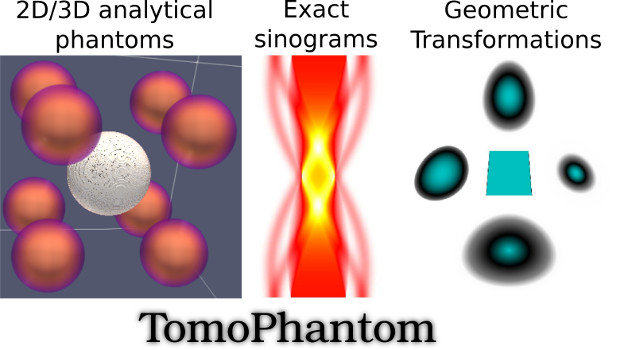

   

****************
**TomoPhantom** is a toolbox to generate customisable analytical 2D and 3D phantoms for various image processing tasks (reconstruction, denoising, deblurring, etc.).
****************

### Detailed description:

**TomoPhantom** is recommended for various image processing tasks that require numerical testing: image reconstruction, denoising, deblurring, etc. 
The software is focused mainly on tomographic image reconstruction (TIR) case. For TIR algorithms testing, the popular [Shepp-Logan phantom](https://en.wikipedia.org/wiki/Shepp%E2%80%93Logan_phantom) is not always a 
good choice due to the piecewise-constant nature. This toolbox provides a simple modular approach to build customisable 2D and 3D phantoms consisting of 
piecewise-constant and also smooth analytical objects. The objects include: gaussians, parabolas, ellipses, cones, rectangulars, etc. The exact Radon
Transform in parallel beam geometry of a phantom can be obtained, therefore producing an analytical sinogram. Those sinograms can be used for testing purposes
without so-called the ['Inverse Crime'](http://www.sciencedirect.com/science/article/pii/S0377042705007296). TomoPhantom is compatable with 
['ASTRA-toolbox'](http://www.astra-toolbox.com/) and therefore the data can be directly reconstructed using ASTRA (see examples). Additionally, the code for geometric transformation 
introduced  in the paper [1] has been added to generate fan-beam sinograms by non-linear deformation of a phantom. 

### Package contents:

**TomoPhantom** is available for MATLAB and Python (all main functions written in C-OMP)
- **Phantom2DGeneratorDemo.m** and **Phantom3DGeneratorDemo.m** are demo scripts;
- **SpectralPhantomDemo.m** a script to generate spectral phantom with 4 dedicated materials;
- **Phantom2DDeformationDemo.m** a script demonstrating nonlinear geometrical transformation [1]; 
- **Phantom2DLibrary.dat** and **Phantom3DLibrary.dat** are editable text files with models parameters;

### Installation:
- For MATLAB run **compile_mex.m** to compiled mexed C functions
- For Python see ReadMe in python 'directory'

### If software is used, please cite the paper:

[1] [D. Kazantsev, V. Pickalov "New iterative reconstruction methods for fan-beam tomography", IPSE, 2017](https://ccpforge.cse.rl.ac.uk/gf/download/frsrelease/582/8704/GP_IPSE.pdf)

For any questions, please e-mail daniil.kazantsev@manchester.ac.uk 

