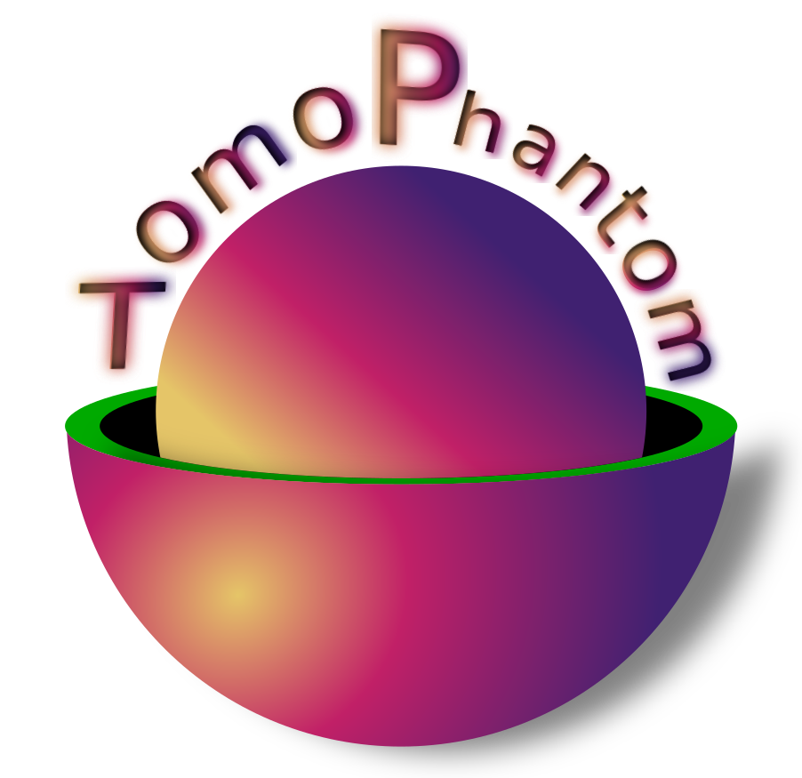
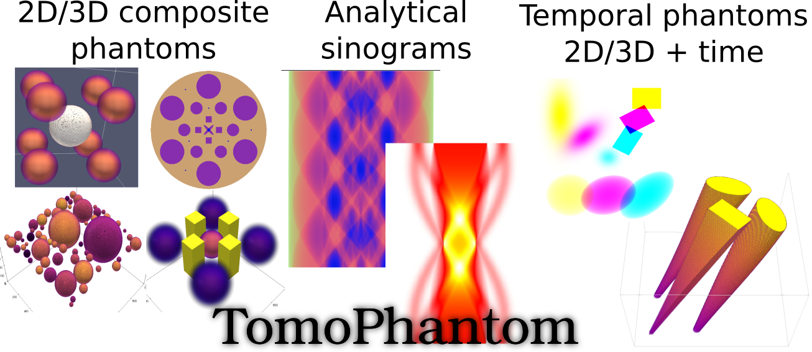
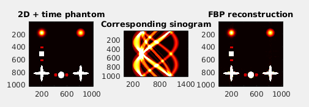

<table>
    <tr>
        <td>
        <div align="left">
          <br>  
        </div>
        </td>
        <td>
        <font size="5"><b> TomoPhantom </b> <a href="https://doi.org/10.1016/j.softx.2018.05.003">[1]</a> is a toolbox to generate customisable 2D-4D phantoms (with a temporal capability) and their analytical tomographic projection data for parallel-beam geometry. It can be used for testing various tomographic reconstruction methods, as well as image processing methods, such as, denoising, deblurring, segmentation, and machine/deep learning tasks. </font>
        </td>
    </tr>
</table>

<div align="center">
  <br>
  <br>
</div>

****************

### NEW!
Please see [changes](CHANGES.md). <a href="https://dkazanc.github.io/TomoPhantom/index.html">Documentation</a> has been updated in January 2025 with 
a lot of additional information, API links, tutorials, etc.

 <div class="post-content">
        <h3 class="post-title">About TomoPhantom </h3>
        <p> TomoPhantom is recommended for various image processing tasks that require extensive numerical testing: image reconstruction, denoising, deblurring, etc. In particular, TomoPhantom is best-suited for testing various tomographic image reconstruction (TIR) methods. For TIR algorithms testing, the popular <a href="https://en.wikipedia.org/wiki/Shepp%E2%80%93Logan_phantom">Shepp-Logan phantom</a> is not always a good choice due to its piecewise-constant nature. This toolbox provides a simple modular approach to efficiently build customisable 2D-4D phantoms consisting of piecewise-constant, piecewise-smooth, and smooth analytical objects as well as their analytical <a href="https://en.wikipedia.org/wiki/Radon_transform">Radon transforms</a> .
        </p>
 </div>

### What **TomoPhantom** can do:         
 * Generate 2D and 3D synthetic phantoms made of Gaussians, parabolas, ellipses, cones and rectangulars.
 * Generate simple temporal extensions of 2D and 3D phantoms.
 * Calculate analytical Radon transforms of 2D-4D models and also their numerical projections.
 * Model a variety of tomographic data artefacts (noise models, zingers, rings, shifts, partial volume effect and others). 
 
### Installation:
TomoPhantom is distributed as a conda package in Python for Linux & Windows:
```
conda install -c httomo tomophantom
```
Please see more detailed information on <a href="https://dkazanc.github.io/TomoPhantom/howto/installation.html">Installation</a> and development environments.

### Related software projects on GitHub:
- [xdesign](https://github.com/tomography/xdesign) XDesign is an open-source Python package for generating configurable simulation phantoms for benchmarking tomographic image reconstruction.
- [syris](https://github.com/ufo-kit/syris) Syris (synchrotron radiation imaging simulation) is a framework for simulations of X-ray absorption and phase contrast dynamic imaging experiments, like time-resolved radiography, tomography or laminography.

### References:

[1] [D. Kazantsev et al. 2018, *TomoPhantom, a software package to generate 2D-4D analytical phantoms for CT image reconstruction algorithm benchmarks*, Software X, Volume 7, January–June 2018, Pages 150–155](https://doi.org/10.1016/j.softx.2018.05.003)

[2] [D. Kazantsev, V. Pickalov "New iterative reconstruction methods for fan-beam tomography", IPSE, 2017](https://doi.org/10.1080/17415977.2017.1340946)

### Applications:
* [TOmographic MOdel-BAsed Reconstruction (ToMoBAR)](https://github.com/dkazanc/ToMoBAR)
* [Joint image reconstruction method with correlative multi-channel prior for X-ray spectral computed tomography](https://github.com/dkazanc/multi-channel-X-ray-CT)
* [Deep learning segmentation of synthetic tomographic data using Pytorch U-net](https://github.com/dkazanc/U-Net-tomography)

Software related questions/comments please e-mail to Daniil Kazantsev at dkazanc@hotmail.com