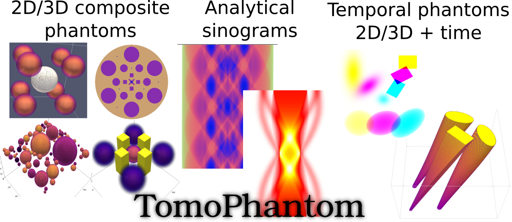
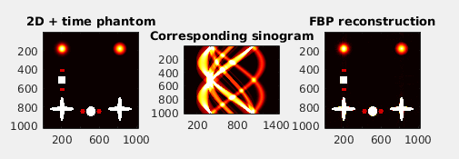

.. |build-status| image:: ttps://github.com/dkazanc/TomoPhantom/actions/workflows/tomophantom_conda_upload/badge.svg?style=svg
    :alt: build status
    :target: ttps://github.com/dkazanc/TomoPhantom/actions/workflows/tomophantom_conda_upload.yaml

**TomoPhantom** (cite [SX2018]_) is a toolbox to generate customisable 2D-4D phantoms 
(with a temporal capability) and their analytical tomographic projections
for parallel-beam geometry. It can be used for testing various tomographic 
reconstruction methods, as well as for image processing methods, 
such as, denoising, deblurring, segmentation, and machine/deep 
learning tasks.

**TomoPhantom** is best-suited for testing various tomographic 
image reconstruction (TIR) methods. For TIR algorithms testing, 
the popular `Shepp-Logan <https://en.wikipedia.org/wiki/Shepp%E2%80%93Logan_phantom>`_
is not always a good choice due to its piecewise-constant nature. This 
toolbox provides a simple modular approach to efficiently build customisable 
2D-4D phantoms consisting of piecewise-constant, piecewise-smooth, and smooth
analytical objects as well as their analytical `Radon transforms <https://en.wikipedia.org/wiki/Radon_transform>`_ 
for parallel-beam scanning geometry. 

Documentation
-------------
Please check the full `documentation <https://dkazanc.github.io/Tomophantom/>`_.

Install TomoPhantom
--------------------------------------------------------
Tomophantom is distributed as a Python conda package for Linux/Windows/Mac OS's:

.. code-block:: console

   $ conda install -c httomo tomophantom
   
See the detailed page on `Installation <https://dkazanc.github.io/TomoPhantom/howto/installation.html>`_.

.. [SX2018] D. Kazantsev et al. 2018, TomoPhantom, a software package to 
   generate 2D-4D analytical phantoms for CT image reconstruction 
   algorithm benchmarks, Software X, Volume 7, 2018, Pages 150-155. Download `here <https://github.com/dkazanc/TomoPhantom/blob/master/docs/Softwarex_Kazantsev_preprint.pdf>`_.