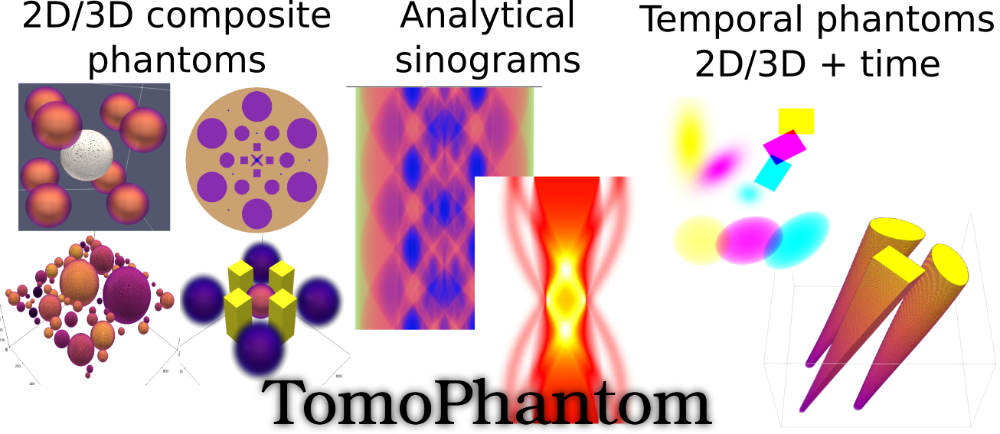
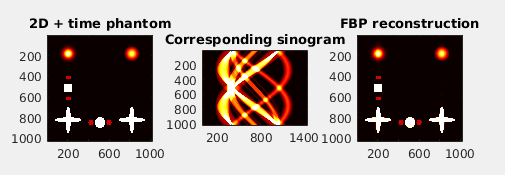

.. |build-status| image:: https://github.com/dkazanc/TomoPhantom/actions/workflows/conda_build.yml/badge.svg
   :alt: build status
   :target: https://github.com/dkazanc/TomoPhantom/actions/workflows/conda_build.yml

**TomoPhantom** [`1 <https://doi.org/10.1016/j.softx.2018.05.003>`_] is a toolbox to generate customisable 2D-4D phantoms
(with a temporal capability) and their analytical tomographic projections
for parallel-beam geometry. It can be used for testing various tomographic
reconstruction methods, as well as for image processing methods
such as denoising, deblurring, segmentation, and machine/deep
learning tasks.

**TomoPhantom** is best-suited for testing various tomographic
image reconstruction (TIR) methods. For TIR algorithms testing,
the popular `Shepp-Logan <https://en.wikipedia.org/wiki/Shepp%E2%80%93Logan_phantom>`_
is not always a good choice due to its piecewise-constant nature. This
toolbox provides a simple modular approach to efficiently build customisable
2D-4D phantoms consisting of piecewise-constant, piecewise-smooth, and smooth
analytical objects as well as their analytical `Radon transforms <https://en.wikipedia.org/wiki/Radon_transform>`_
for parallel-beam scanning geometry.

Install TomoPhantom
-------------------

TomoPhantom is distributed as a conda package in Python for Linux & Windows:

.. code-block:: console

   $ conda install -c httomo tomophantom

See the detailed installation page on :ref:`ref_installation`.
