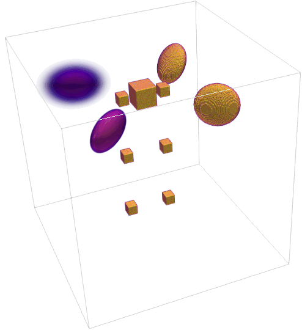
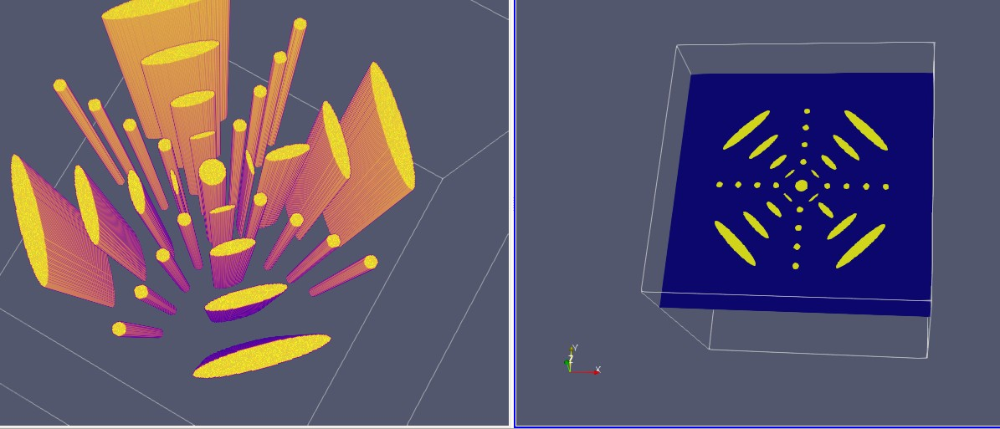
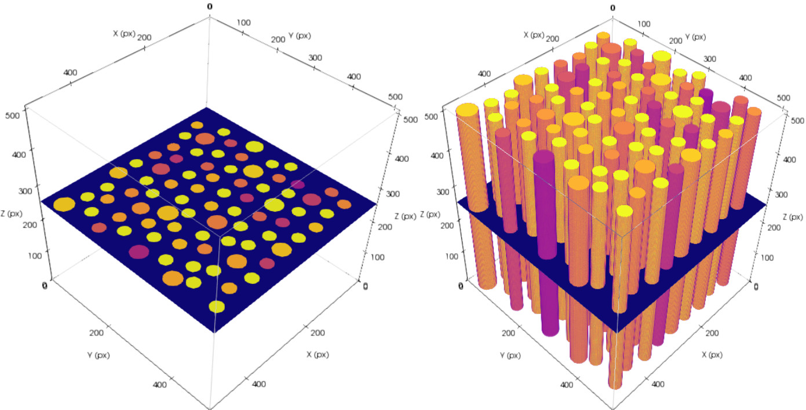

About TomoPhantom
*****************

The general concept
=====================

The variety of image processing techniques, such as, reconstruction, 
denoising, deblurring, inpainting, and segmentation require simulated 
ground truth data in order to numerically verify, benchmark and evaluate 
the proposed methods. The ground truth data can have various 
characteristics specific to the acquisition hardware, which also can be 
the focus of image processing method developers. In many situations, 
however, over-simplistic or unsuitable simulated data are used for testing.

In TomoPhantom, projection data is calculated following analytical 
Radon transform derivations applied to elementary functions. 
This approach is different to conventional numerical calculation 
of projections for the forward X-ray acquisition model using 
ray-tracing algorithms. Analytical projections 
are exact and discretized over a different grid which normally 
used for projection and backprojection steps in reconstruction
methods. TomoPhantom enables a convenient testing environment 
for novel reconstruction methods, therefore avoiding the "inverse crime"
issue (data simulation using the same grid). Overall, the use of exact
projections and known ground truth is especially beneficial for
benchmarking of iterative reconstruction algorithms.

TomoPhantom also offers simple linear dynamic extensions of 2D and 3D phantoms.

The generated TomoPhantom projection data is
compatible with widely-used open-source tomographic reconstruction 
software, such as, ASTRA-toolbox and TomoPy packages.

What TomoPhantom can do
=========================
* Generate 2D and 3D synthetic phantoms made of Gaussians, parabolas, ellipses, cones and rectangulars.
* Generate simple temporal extensions of 2D and 3D phantoms.
* Calculate analytical Radon transforms of 2D-4D models and also their numerical projections.
* Model a variety of tomographic data artefacts (noise models, zingers, rings, shifts, partial volume effect and others). 

