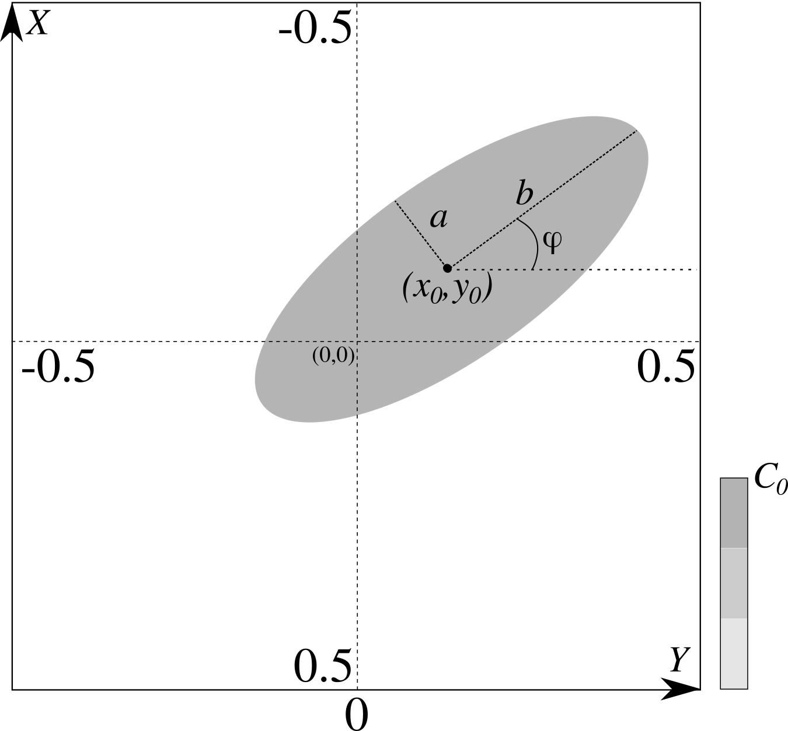

.. _ref_object_api:

Object API
==========

.. _ref_object_2d:

Parameters of 2D objects explained
----------------------------------

There are 7 parameters in total to describe an object.

.. dropdown:: 1. object's name, type: string

	For 2D phantoms the accepted objects names are :code:`gaussian`, :code:`parabola`, :code:`parabola1`, :code:`ellipse`, :code:`cone` and :code:`rectangle`. See more in the TomoPhantom paper [SX2018]_ for analytical formulae.

.. dropdown:: 1. C0 - intensity level, type: float

	:math:`C_{0}` defines the grayscale intensity level (see :numref:`fig_objects2d_notations`), given as a floating point number. :math:`C_{0}` can be either negative or positive. Objects in the model are concatenated by summation, so one can do a subtraction of objects by defining negative intensities.  

.. _fig_objects2d_notations:

    The coordinate system in which objects are defined. Note the location of :math:`X` and :math:`Y` axes and the ranges for the visible field of view. Parameters describing a 2D object are: object's name, :math:`C_{0}`, :math:`x_{0}`, :math:`y_{0}`, :math:`a`, :math:`b` and angle :math:`\phi`.

.. _ref_object_api2d:

Parameters of 2D object in library file
---------------------------------------

Let us look at this line in detail: 

.. code-block:: text

    Object : ellipse 1.0 0.0 0.0 0.69 0.92 0.0;

TomoPhantom converts this string of 7 parameters for 2D model into the following behind the scenes:

.. code-block:: text

    objects_name="ellipse"
    C0=1.0
    x0=0.0
    y0=0.0
    a=0.69
    b=0.92
    angle=0.0

.. _ref_object_api_python2d:

Defining 2D object in Python
----------------------------

.. _ref_object_3d:

Parameters of 3D objects explained
----------------------------------

.. _ref_object_api3d:

Parameters of 3D object in library file
---------------------------------------

