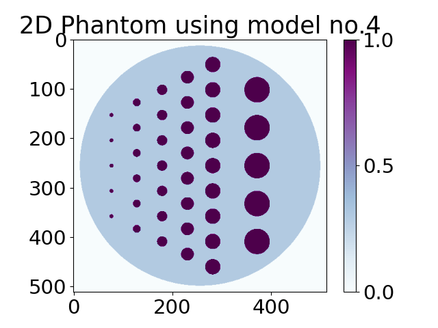
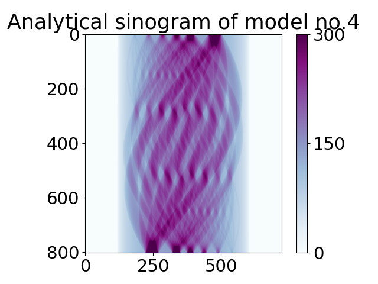

.. _tutorial_model:

Phantoms using models
*********************

This tutorial shows how to build 2D phantoms using already pre-existing :ref:`ref_glossary_model` stored in :ref:`ref_glossary_library`.
One can also see `Demos <https://github.com/dkazanc/TomoPhantom/tree/master/Demos>`_ on how to build 3D or dynamic phantoms and hands-on experience. 

.. code-block:: python

    import tomophantom
    from tomophantom import TomoP2D

    model = 4  # select a model number from the library file (Phantom2DLibrary)
    N_size = 512  # set the desired dimension of the phantom

    path = os.path.dirname(tomophantom.__file__)  
    path_library2D = os.path.join(path, "phantomlib", "Phantom2DLibrary.dat") # path to the parameters file

    phantom_2D = TomoP2D.Model(model, N_size, path_library2D) # Generate a N_size x N_size phantom (2D)

One can also create a projection data (sinogram for 2D phantom) by pointing to the same model number in the library file.

.. code-block:: python

    import tomophantom
    from tomophantom import TomoP2D

    model = 4  # select a model number from the library file (Phantom2DLibrary)
    N_size = 512  # set the desired dimension of the phantom

    path = os.path.dirname(tomophantom.__file__)  
    path_library2D = os.path.join(path, "phantomlib", "Phantom2DLibrary.dat") # path to the parameters file

    # Parameters to generate a sinogram
    angles_num = int(0.5 * np.pi * N_size)
    angles = np.linspace(0.0, 179.9, angles_num, dtype="float32")
    P = int(np.sqrt(2) * N_size)  # detectors size

    # create sinogram analytically
    sino_an = TomoP2D.ModelSino(model, N_size, P, angles, path_library2D)

    