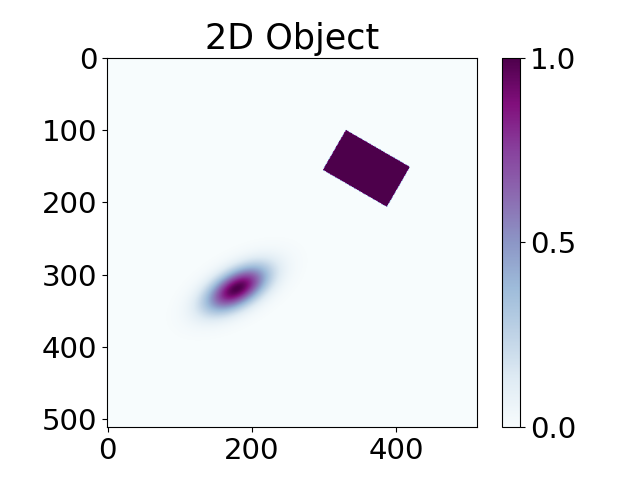
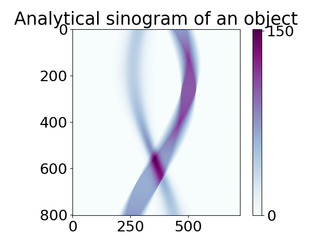

.. _tutorial_object:

Phantoms using objects
**********************

This tutorial shows how to build 2D phantom using :ref:`ref_glossary_object`  and without  :ref:`ref_glossary_library`.
One can also see `Demos <https://github.com/dkazanc/TomoPhantom/tree/master/Demos>`_ on how to build 3D or dynamic phantoms and hands-on experience. 

.. code-block:: python

    from tomophantom import TomoP2D
    from tomophantom.TomoP2D import Objects2D

    N_size = 512  # define the size of the phantom

    # define objects and parameters:
    pp = {
        "Obj": Objects2D.GAUSSIAN,
        "C0": 1.00,
        "x0": 0.25,
        "y0": -0.3,
        "a": 0.15,
        "b": 0.3,
        "phi": -30.0,
    }

    pp1 = {
        "Obj": Objects2D.RECTANGLE,
        "C0": 1.00,
        "x0": -0.2,
        "y0": 0.2,
        "a": 0.25,
        "b": 0.4,
        "phi": 60.0,
    }

    myObjects = [pp, pp1]  # dictionary of objects
    phantom = TomoP2D.Object(N_size, myObjects)

Using the list of dictionaries :code:`myObjects` created above, we can now generate a sinogram for that phantom.

.. code-block:: python

    angles_num = int(0.5 * np.pi * N_size)
    angles = np.linspace(0, 180, angles_num, dtype="float32")
    angles_rad = angles * (np.pi / 180)
    P = int(np.sqrt(2) * N_size)  # detectors size

    sino_an = TomoP2D.ObjectSino(N_size, P, angles, myObjects)

